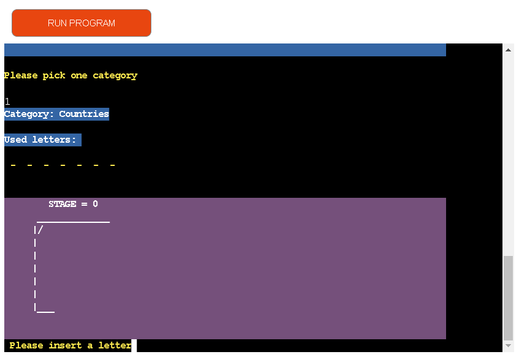

# Hangman Game

Welcome to Hangman Game, a classic word guessing game implemented in Python! This game runs in the terminal, allowing you to challenge your word-solving skills and have fun while doing it.

[View the live project here.](https://hangman-fazel.herokuapp.com//)

## About

Hangman Game is a classic word guessing game where players attempt to uncover a hidden word by suggesting letters or providing the full answer. In this version of the game, you'll be pitted against the computer as your opponent.

The hidden word is represented by a series of dashes, with each dash representing a letter in the word. When you suggest a letter that exists in the word, it will be revealed in all its correct positions. However, if your suggestion is incorrect, the computer will incrementally draw the hangman diagram.

The game continues until either the entire word is guessed correctly or the hangman's diagram is completed, resulting in a loss. You have a total of 7 attempts to decipher the word correctly and emerge victorious.

All the words used in this game are categorized into four categories: Countries, Animals, Foods, and Objects.

## User Experience (UX)
- ### UX

  - #### As a User, I should to be able to:

    1. Acquire a clear comprehension of how to navigate the game and start playing.
    2. Conveniently obtain comprehensive guidelines for gameplay.
    3. Understand the necessary user input and receive suitable error messages to maintain game stability.
    4. Track the number of incorrect guesses until the game reaches its conclusion.
    5. Uncover the secret word if the user fails to guess it within the allotted attempts.
    6. Seamlessly proceed with the game without the requirement to reenter initial inputs.
    7. Delight in an enjoyable and fully operational gaming experience.

## Features

- ### Existing Features

  - #### 1. Welcome Message and User Name Prompt
    - Upon launching the Hangman Game, players are greeted with a warm welcome message. They are invited to enter their name, which adds a personal touch to the gameplay experience. Here's an example of the welcome message and name prompt.
    
  - #### 2.User Age Prompt
    - After the player enters their name, the Hangman Game prompts them to enter their age. This feature ensures that the game is played by an appropriate age group. Players who are 6 years old or older are eligible to play the game, while those below 6 years old are considered ineligible.
      
  - #### 3.Menu

    - Once the player is eligible to play the Hangman Game, they are presented with a main menu that offers three options: viewing the game rules, starting the game, or exiting the game. The main menu allows the player to choose their desired action.
      The player can enter the corresponding number to select their desired option.

      - If the player selects option 1, the game displays the rules of the Hangman Game.
      - If the player selects option 2, the game starts and the player can begin guessing the letters to uncover the secret word.
      - If the player selects option 3, the game exits gracefully with a goodbye message.

    The main menu provides an easy and intuitive way for the player to access the different functionalities of the game, allowing them to choose whether to view the rules, play the game, or exit.

    

  - ##### 3.1 Rules
    - If the player selects option 1, the game displays the rules of the Hangman Game.
      
  - ##### 3.2 Play
    - If the player selects option 2, the game starts and the player can begin guessing the letters to uncover the secret word.
      
  - ##### 3.3 Exit
    - If the player selects option 3, the game asks for confirmation before exiting. The player is prompted to enter 'Y' to confirm the exit or any other key to return to the main menu
      

- #### 4. Category Selection
  - Once the player chooses to start the game from the main menu, they will be prompted to select a category for the secret word. The categories available for selection are "Countries," "Animals," "Foods," and "Objects."
    
- #### 5. Word Guessing

  - After selecting a category, the player enters the word guessing phase of the game. The user interface will display several elements to assist the player in their guessing process.
    1. Category: The chosen category will be displayed at the top of the screen, reminding the player of the theme of the secret word.
    2. Used Letters: A list of letters that the player has already guessed will be shown. This helps the player avoid repeating guesses.
    3. Secret Word: The secret word is represented by a series of dashes, with each dash representing a letter in the word. Initially, all letters are hidden, and dashes are displayed instead. As the player correctly guesses letters, the corresponding dashes are replaced with the revealed letters.
    4. Hangman Stage: A graphical representation of the hangman will be displayed. With each incorrect guess, a new part of the hangman is added, gradually completing the figure. The stage of the hangman visually indicates the player's progress and the number of incorrect guesses made so far.

  The player will be prompted to enter a letter as their guess. If the letter is valid (a single alphabetic character that has not been previously guessed), the game will evaluate whether the letter is present in the secret word. If the guessed letter is correct, it will be revealed in the corresponding positions in the secret word. Otherwise, the hangman stage will progress, indicating an incorrect guess.

  

- #### 5. Result

  - The game continues until one of the following conditions is met:

    - The player correctly guesses the entire secret word, resulting in a victory.
    - The hangman stage is completed, indicating that the player has run out of allowed incorrect guesses, resulting in a loss.

    At the end of the game, the player will be notified of the outcome (win or loss) and shown the complete secret word.
    
    

- ### Future Features
  - In order to cater to a wider audience, the Hangman game can be enhanced with multi-language support. This feature allows players to enjoy the game in languages other than English.

## Design

- To enhance the visual appeal and create a more engaging user interface, the Hangman game utilizes ANSI escape codes to change the background colors. This feature adds a touch of color and liveliness to the terminal-based game.

Here's how the design aspect is implemented:

1.  Background Color Selection: The game utilizes a dictionary of ANSI escape codes, mapping different color names to their corresponding escape sequences. These color names include black, red, green, yellow, blue, magenta, cyan, white, and reset (to revert back to the default color).

2.  Colorful Text Output: The chosen background color is applied to the text by surrounding it with the appropriate escape sequences. This creates a visually distinct and colorful presentation for different sections of the game, such as menu options, messages, and graphical elements.

3.  Color Feedback: The background color is used to provide visual feedback to the player. For example, a correct letter guessed might be displayed in green, indicating success, while an incorrect letter might be displayed in red, indicating a wrong guess. This color feedback enhances the gaming experience and helps the player easily interpret the game's status.

By utilizing ANSI escape codes for background color changes, the Hangman game achieves a more vibrant and visually appealing user interface. The use of colors adds an extra dimension to the gameplay and creates an immersive experience for the players.

## Technologies Used

- Python.
- [Am I Responsive:](http://ami.responsivedesign.is) Demonstrate the game's appearance on different devices.
- [Git](https://git-scm.com/) Git was employed for version control, utilizing the Gitpod terminal to perform Git commits and push changes to GitHub.
- [GitHub:](https://github.com/) GitHub serves as a repository for storing the project's code after it has been pushed from Git.
- [Heroku:](https://dashboard.heroku.com/) The application was deployed using Heroku.

## Deployment

The site was deployed to Heroku. The steps to deploy are as follows:
  1. Log in to Heroku.
  2. Click "Create new app".
  3. Choose app name and choose a region.
  4. Click "Create app".
  5. Navigate to the "settings" tab.
  6. "Click "Reveal Config Vars".
  7. Add Config Var in Heroku's Settings. The key is PORT and the value is 8000
  8. Scroll down to "Buildpacks".
  9. Click "Add Buildpack".
  10. First add "python", click save.
  11. Second add "nodejs", click save.

### Automated Deployments from GitHub disabled by Heroku.

Follow the steps below to deploy from your Gitpod workspace:
  1. Open the terminal.
  2. command: heroku login -i
  3. Get your app name from heroku.
  4. command: heroku apps
  5. Set the heroku remote. (Replace <app_name> with your actual app name and remove the <> characters)
  6. command: heroku git:remote -a <app_name>
  7. Add and commit any changes to your code if applicable
  8. command: git add . && git commit -m "Deploy to Heroku via CLI"
  9. Push to both GitHub and Heroku
  10. command: git push origin main
  11. command: git push heroku main

## Credits

- [Am I Responsive:](http://ami.responsivedesign.is) Checking the responsive.
- [Hangman Grphical and Logo:](https://ascii.co.uk/art/hangman) Inspiration for creating A Simple Hangman Game in Python.
- [Stackoverflow:](https://stackoverflow.com/questions/287871/how-do-i-print-colored-text-to-the-terminal) How do I print colored text to the terminal.
- [Invent with python:](https://www.kaggle.com/general/273188)  Add Colour to Text in Python.

### Acknowledgements

- I am grateful to my mentor, Brian Macharia from Code Institute, for providing code reviews, assistance, and feedback.